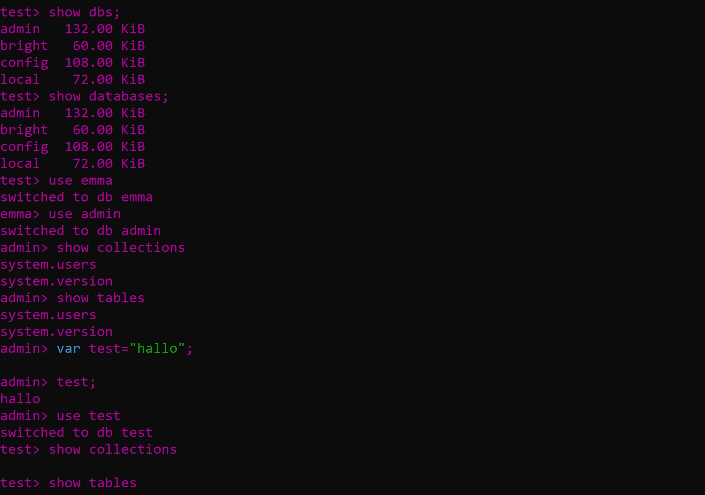

### A. Installation


#### Authsource

Explicitly specifies that the authentication should be performed using the "admin" database. MongoDB would look for the authentication credentials (username "admin", password "admin") within the "admin" database.

Without specifying authSource=admin, MongoDB would default to using the default authentication database, which might not be "admin" in this case, potentially leading to authentication errors.

#### Sed commands

`sudo sed -i 's/#security:/security:\n authorization: enabled/g' /etc/mongod.conf`

adds authorization settings to the MongoDB configuration file. It searches for the line containing #security: and replaces it with two lines: security: and authorization: enabled.

`sudo sed -i 's/127.0.0.1/0.0.0.0/g' /etc/mongod.conf`

The second sed command replaces 127.0.0.1 with 0.0.0.0 in the configuration file /etc/mongod.conf. This changes the bind IP address of MongoDB from localhost to all available IP addresses on the server.

Summarised, it adds MongoDB user creation commands to the file.


### B. GUI


(As importing the date would throw an error for me, I manually wrote it in after importing the json)


If the date was not saved as a date type in the UI, it's likely that it was stored as a string.
By explicitly specifying the date as an object with the $date key and providing the date string in ISO 8601 format, MongoDB will recognize it as a date object when storing it in the collection.

It would theoretically look something like this:

```json{
  "_id": {
    "$oid": "66421a0dc9d5a49003acfd65"
  },
  "Name": "Emma",
  "Nachname": "Bright",
  "Age": 17,
  "Grösse": 175,
  "Geburtsdatum": {
    "$date": "2006-05-23T00:00:00.000Z"
  }
}
```

In my case, I had to manually update the data in mongoDB to add the birthdate. Then everything worked out.

### C. Shell




`sudo mongosh -u admin -p admin`

Commands 1-2 do the same thing, namely showing the databases.

3 Switches to the specified database\*

4 shows all collections of the current database

5 shows all the collections again despite asking for tables, as collections are mongodbs version of tables.

\*side note: right after switching to my collection name, I switched to the admin database so that the following commands would display some form of data.

As I attempted to switch to my collection as a db (which isn't a database) printing commands 4 and 5 would display nothing.
